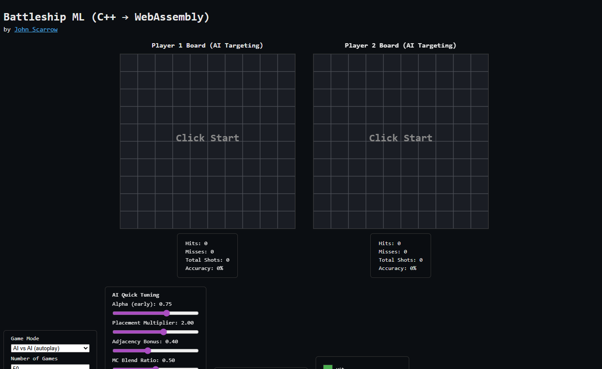

<!--
# Hi there 👋

**JohnScarrow/JohnScarrow** is a ✨ _special_ ✨ repository because its `README.md` (this file) appears on your GitHub profile.

Here are some ideas to get you started:

- 🔭 I’m currently working on ...
- 🌱 I’m currently learning ...
- 👯 I’m looking to collaborate on ...
- 🤔 I’m looking for help with ...
- 💬 Ask me about ...
- 📫 How to reach me: ...
- 😄 Pronouns: ...
- ⚡ Fun fact: ...
-->


# Hi — I'm John Scarrow 👋

[](LICENSE)

Welcome — this repository is the special profile README for my GitHub and serves as a lightweight portfolio landing page. Below you'll find a featured project, highlights of my work, tech stack, and contact links.

---

## Featured Project — Battleship-ML

A modern take on the classic Battleship game with machine learning components. Battleship-ML demonstrates applied ML in a game environment, a configurable CLI, and an experimental web demo via WebAssembly.

- **Highlights:** AI opponent (reinforcement learning / heuristic hybrids), modular game engine, training pipeline, and an optional browser demo (WASM).
- **Tech:** C++, Python (training), WebAssembly, PyTorch/TensorFlow (or your preferred ML lib), build tooling (CMake/emscripten).

Screenshot / Demo



Quick start (example)

```bash
# Clone this repo (if Battleship code is in a subfolder, adjust accordingly)
git clone https://github.com/JohnScarrow/JohnScarrow.git
cd JohnScarrow

# If the Battleship project is in `battleship-ml/`:
cd battleship-ml
# Build/run (example; replace with your project's build commands)
mkdir -p build && cd build
cmake .. && make
./battleship

# Or run the training script (example)
python3 train.py --config configs/train.yaml
```


Play the demo

> Note: GitHub sanitizes `README.md` HTML and disallows embedding active content like `iframe`. Because of this you cannot directly play the demo inside the README itself. Use the links below to open the demo or visit a Pages-hosted iframe page.

- Direct demo URL: https://johnscarrow.github.io/battleship-ml/
- Open GitHub Pages iframe page: `https://<your-username>.github.io/<repo>/` after enabling Pages (I added a `docs/index.html` that embeds the demo; see below).

You can replace `<your-username>` and `<repo>` with your GitHub username and this repository name if you want the iframe page to live under this repo (for example `https://johnscarrow.github.io/JohnScarrow/`).

### Battleship-ML — GPU setup (local)

If you want to run the Battleship-ML tuner locally with GPU acceleration (to play many more games concurrently), follow these steps.

- Prerequisites:
	- NVIDIA GPU with a compatible driver installed.
	- CUDA toolkit (nvcc) installed and on your `PATH` (CUDA 11+ recommended).
	- Standard build tools (`g++`, `make`, etc.).

- Quick checks:
	- `nvidia-smi` — confirm the GPU is visible and drivers are loaded.
	- `nvcc --version` — confirm CUDA toolchain is installed.

- Build the CUDA-enabled tuner (from the `battleship-ml/` folder):
```bash
cd battleship-ml
./scripts/build_tuner_cuda.sh
```
This creates a `tuner` binary that will use CUDA if available.

- Running for high concurrency:
	- Single-process (use `threads` to increase concurrency inside one process):
```bash
./tuner games=10000 threads=32 mcIterations=1600 > results.csv
```
	- Multiple processes (useful for many independent runs or multi-GPU):
```bash
# 4 processes sharing the same GPU (they will contend for GPU resources)
for i in 1 2 3 4; do
	./tuner games=2000 threads=8 mcIterations=800 > results-$i.csv 2>&1 &
done

# Pin one process to GPU 0 and one to GPU 1 on multi-GPU systems
CUDA_VISIBLE_DEVICES=0 ./tuner games=5000 threads=8 mcIterations=1200 > out-gpu0.csv &
CUDA_VISIBLE_DEVICES=1 ./tuner games=5000 threads=8 mcIterations=1200 > out-gpu1.csv &
```

- Monitoring & tuning:
	- Monitor `nvidia-smi` (e.g. `watch -n1 nvidia-smi`) to observe GPU utilization and memory.
	- Increase `mcIterations` to give the GPU more work per Monte-Carlo decision (reduces host/GPU overhead).
	- Adjust `threads` to match CPU cores and how the workload pipelines to the GPU.

- Troubleshooting:
	- If the binary falls back to CPU, confirm you built with the provided CUDA script and that `nvidia-smi` and `nvcc` succeed.
	- For driver/CUDA mismatch, update your driver or use a CUDA toolkit version compatible with your driver.


---

## Other Projects

- **Responsible Consumption** — React + Express. A journaling app for mindful consumption. Source available in separate repo(s).
- **PlaylistFor.ME** — JavaScript. Playlist generator using external music APIs.

---

## About Me

- 🎓 First-year Computer Science student at North Idaho College
- 💻 Full‑stack development, AI integration, and systems engineering
- 🛠 Projects: game engines, ML experiments, autonomous systems, and cloud tooling

---

## Tech & Tools

- **Languages:** C++, Python, JavaScript
- **Frameworks / Tools:** React, Express, PyTorch / TensorFlow, CMake, Emscripten
- **Cloud / DevOps:** AWS, GitHub, Docker (learning)

---

## Contact & Links

- **GitHub:** `https://github.com/JohnScarrow`
- **LinkedIn:** `(https://www.linkedin.com/in/johnascarrow/)`
- **Portfolio:** `https://johnscarrow.github.io/`

If you'd like, I can:

- add live demo hosting via GitHub Pages or `gh-pages` branch
- create a minimal `docs/` site for the WASM demo
- add screenshots and a short walkthrough for Battleship-ML

---

⭐ Thanks for stopping by — want me to set up GitHub Pages next? (I can scaffold a `docs/` site and add a demo.)
